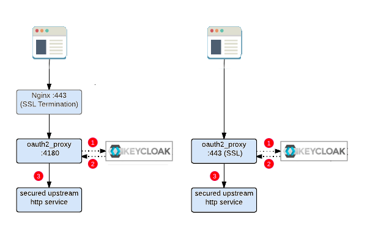

**SSO Developers guide (crash course)**
October 2023
-------------------------------------------------------------------
#### Gennady Unger

This guide starts from the point where the Red Hat SSO(RHSSO) server is up and running.

Note that the RHSSO server wraps another product named Keycloak, so further explanations will be provided as interaction with Keycloak for simplicity. 

## **Terminology**
Before diving into the code, let’s overview some definitions that are required for better understanding of authentication/authorization mechanisms and flows, which in turn will be reflected in coding approaches.
### Realm
A realm is a domain(or a namespace) in which several types of entities can be defined, the most prominent being:

- **Users:** basic entities that are allowed access to a Keycloak-secured system.
- **Roles:** a user’s authorization level, such as “admin”, “manager”, “reader” and etc.
- **Clients:** browser apps and web services that are allowed to request a login.
- **Identity Providers:** external providers to integrate with, such as Google, Facebook, or any system which implements an “OpenID Connect” authentication protocol based on the OAuth2 framework(RFC 6749 and 6750).
### Token
The OAuth2 clients (front-end applications) can obtain access tokens from the server and use these same tokens to access resources protected by a resource server (back-end services). 

Keycloak Authorization Services provide extensions to OAuth2 to allow access tokens to be issued based on the processing of all policies associated with the resource(s) or scope(s) being requested. This means that resource servers can enforce access to their protected resources based on the permissions granted by the server and held by an access token. In Keycloak Authorization Services the access token with permissions is called a Requesting Party Token or RPT for short.

For example,
The front-end application uses an OAuth2 client in order to authenticate against a Keycloak and in turn obtain an access token with permissions. This token will be used by the front-end to access resources protected by a back-end service.
### Authorization flows (Grant Type)
The OAuth 2.0 protocol describes four possible authorization flows while each of them has a particular use case.

- **Authorization Code Grant:** used by server side applications.

- **Implicit Grant:** used by mobile or web applications(e.g: SPA), or by any other applications that run on the user's device (User Agent).
  In this flow, the Access Token is passed on to the User Agent, *potentially making the Access Token accessible to unauthorized parties*. It’s use is valid, but not recommended and where possible you should use the Authorization Code Grant with Proof Key for Code Exchange (PKCE), which is an extension of the Authorization Code Grant and described in a separate specification (RFC 7636).

- **Resource Owner Password Credentials Grant:** used by applications considered highly secure (trusted) since the user's credentials pass through the application itself. It is typically used in legacy or migration applications. 
  The specification itself says in paragraph 10.7 that it is an *anti‑pattern* compared to what the protocol itself tries to avoid: the user must grant his credentials to the client who will impersonate him.

- **Client Credentials Grant:** used for API access through machine-to machine(M2M) interaction.

### Keycloak client
Clients are browser apps and web services that are either allowed to initiate the login process or have been provided with tokens resulting from earlier logins. The exception is the Bearer-only client which is intended for M2M interactions.
### Access Type
Client Access Type may be one of three possible values:

- **Bearer-only** – this is for services that rely solely on the bearer token included in the request and never initiate login on their own. It’s typically used for securing the back-end.
- **Confidential** – clients of this type need to provide a secret in order to initiate the login process.
- **Public** – since we have no real way of hiding the secret in a JS-based browser app, this is what we need to stick with in the front-end applications.

### Valid Redirect URIs
This is the URI pattern (one or more) which the browser can redirect to after completing the login process.

### Web Origins
Governs CORS requests.

### Client configuration 
Configuration to use within the application. It can be obtained from the Installation tab of Keycloak client configuration. Just go to the Installation tab and select Keycloak OIDC JSON as the format. Note that other formats like XML are provided as well.
## Scopes & Claims
Client scope - is a way to manage the roles that get declared inside an access token. When a client requests that a user be authenticated, the access token they receive back will only contain the role mappings you’ve explicitly specified for the client’s scope. 

Client scopes definitions are shared between multiple clients.

Default Client Scopes - are the same as regular Client scope, but added automatically to each created client.
## Roles & Groups
- **Role** - define a type or category of user associated with some permission. Admin, user, manager, and employee are all typical roles that may exist in an organization. Applications often assign access and permissions to specific roles rather than individual users as dealing with users can be too fine grained and hard to manage.
  The roles may be of three types: 
  - *Realm roles* - roles are a global over a Realm.
  - *Client roles* -  dedicated to a client.
  - *Composite roles* - has one or more additional roles associated with it. The inheritance of the role is recursive so any composite of composites also gets inherited.

- **Group** - a collection of users that you can apply roles and attributes to in one place. It manages a common set of attributes and role mappings for a set of users. Users can be members of zero or more groups. Users inherit the attributes and role mappings assigned to each group. A group can have many subgroups, but a group can only have one parent. Subgroups inherit the attributes and role mappings from the parent.
## **Getting started** 
### The workflows
The section describes *relations* between application architecture, workflow and Keycloak client types.

|Application type (use)|Authorization flow  (Grant Type)|Keycloak client (Access Type)|Notes|
| :-: | :-: | :-: | :-: |
|Mobile or web applications (SPA)|Implicit Grant|Public|userName and password => token|
|Legacy monolith|Resource Owner Password Credentials Grant|Public|userName and password => access token|
|API gateways or M2M interaction|Client Credentials Grant|Confidential|Client ID and secret|
|API gateways or Server side applications|Authorization Code Grant|Bearer-only|Bearer token|

#### Workflow: Web application (Front-end)

**Case:**  application which consists of a front-end application and the back-end service. The authentication is done via Keycloak. The workflow looks like the following: 

- The user logs into the frontend(browser) and gets a token from Keycloak.
- This token is sent to the backend with every request.
- The back-end uses a token to request the Keycloak for client authentication and  the authorization(when defined) for the requested resource. In case of failure, respond with the “access denied” to the client(HTTP code 403 - forbidden).

**Case:** application which consists of a frontend and several backend services. The backend consists of the API gateway(protected) service and  the back-end(unprotected).The authentication is done via Keycloak. The workflow looks like the following: 

- The user logs into the frontend and gets a token from Keycloak.
- This token is sent to the backend with every request.
- The API gateway uses a token to request the Keycloak for client authentication and  the authorization(when defined) for the requested resource and in case of success, forwards the request without token to the unprotected back-end. In case of failure, respond with the “access denied” to the client(HTTP code 403 - forbidden).
- The back-end serves the client request on and returns a response to the API gateway.
- The API gateway transfer response from the **unprotected** back-end to the client.

#### Workflow: Machine to machine communication(M2M)

With machine-to-machine (M2M) applications, such as CLIs, daemons, or services running on the back-end, the system authenticates and authorizes the application rather than a user. For this scenario, typical authentication schemes like username with password or social logins do not make sense. 
For that purpose the Keycloak implements “service accounts” which supports the simple idea that a service account is just a machine user. Note that the service accounts don’t show up on user searches, hence, no user information can be accessed. For that reason, in order to communicate with each other, the applications pass along their Client ID and Client Secret to authenticate themselves and get a token.

Remember, that the following Keycloak client types may be used in M2M interaction:

- Confidential (when “Implicit Flow Enabled” is OFF)
- Bearer-only

The decision which type of client to use may be driven by pros and cons of each by following:

||Pros|Cons|
| :- | :- | :- |
|Bearer-only|Setup simplicity|- Less authorization options|
|Confidential|- Service Account ability. - Fine grained authorization|When “Implicit Flow Enabled” is ON and there is no option to change it (externally managed)|

The following example illustrates the use of a “confidential client” with a “service account” on back-end service. In the given scenario, the front-end application has its own “public client” which accesses the back-end service with a “confidential client” using a token. When the access is granted, the back-end is trying to make a call to Keycloak API in order to get some resources.

Here the Keycloak API call represents interaction with another service, as an example of M2M interaction between the back-end service and API server. It requires *an additional token* that must be obtained by the back-end for the “service account” user from Keycloak and used for interaction with the it’s API:

**The M2M interaction closeup.**

From technical point of view, the token is passed by “Authorization” header in HTTP request between machines with each other as following: 
['Authorization'] = 'Bearer ' + token;

**Case:** application which consists of a front-end and several back-end services. The following client types are used for  the given case:

- Front-End: public client
- Back-end “service A”: Bearer-only client 
- Back-end “service B”: Confidential client

The Keycloak authentication workflow looks like the following: 

- The user logs into the front-end and gets a token from Keycloak.
- This token is sent to the back-end “service A” with every request using the HTTP header as follows: ['Authorization'] = 'Bearer ' + token;
- The back-end “service A” uses a token from the front-end to request the Keycloak for client authentication and  the authorization(when defined) for the requested resource and in case of success, forwards the request with a token to the other protected back-end “service B”. In case of failure, respond with the “access denied” to the client(HTTP code 403 - forbidden).
- The back-end “service B” uses a token from “service A” to request the Keycloak for client authentication and  the authorization(when defined) for the requested resource and in case of success, serves the request and return response. In case of failure, respond with the “access denied” to the client(HTTP code 403 - forbidden). 
- The back-end “service A” receives a response from “service B” and returns a response to the front-end application.
- The front-end application receives a response from the **protected** back-end(s).

NOTE: As a more common case, The back-end “service B” may forward requests to some other service with or without a token depending if the service is protected or not.

### Oauth2 Proxy - The alternative (code-free) workflow
#### Workflow: Web application with Front-end and/or Backend

**Case:**  application which consists of a following:

- The front-end application and the back-end service. 
- The front-end application only
- The back-end service only.

As in cases above, the authentication is done via Keycloak, however with the help of a small  reverse proxy that provides authentication using Keycloak as a provider. The workflow looks like the following: 

Browser based flow:
1\. The user is browsing to the URL of Oauth2 Proxy server with credentials in order to initialize the login process to the Keycloak server.
2\. When credentials are valid, Oauth2 proxy makes a redirect to its upstream service(back-end or  front-end).
3\. This token is saved as cookie(default setting) while Oauth2 Proxy server uses it within every request to the upstream service.

**NOTE:** The purpose of NGINX in the flow is to provide support for SSL, CORS handling etc.

There is no coding required, only definitions in Keycloak and Oauth2 Proxy server.
These definitions goes as following:

**Keycloak settings:**

|**parameter**|**value**|**notes**|
| :- | :- | :- |
|Client type|confidential|Bearer-only may be used for M2M flow|
|Redirect URL|<oauth2-proxy-host>:4180/oauth2/callback||
|Web Origins|\*|Cors handling|

**Oauth2 Proxy settings:**

|**parameter**|**value**|**notes**|
| :- | :- | :- |
|--provider|keycloak-oidc||
|--set-xauthrequest|true||
|--auth-logging|true|optional|
|--pass-authorization-header|true||
|--request-logging|true|optional|
|--client-id|${client\_id}||
|--client-secret|${client\_secret}||
|--cookie-secret|${client\_secret}|Not used, but mandatory ))|
|--redirect-url|${redirect\_url}||
|--upstream|${upstream\_url}|Pass to the service|
|--oidc-issuer-url|http://<keycloak\_host>:<keycloak\_port>/auth/realms/<realm\_name>|Provider URL(Keycloak)|
|--email-domain|\*|Use real domain|
|--show-debug-on-error|true|optional|
|--pass-user-headers|true||
|--skip-jwt-bearer-tokens|false||
|--skip-provider-button|true|Skip Oauth2 login page|
|--skip-auth-preflight|true|CORS Handling|
|--pass-access-token|true||
|--code-challenge-method|S256||
|--whitelist-domain|<front-end-host> <back-end-host> <oauth2-proxy-host>|CORS handling|
|--session-store-type|cookie||
|--cookie-expire|5m|Value from Keycloak|
|--cookie-refresh|3m|Value from Keycloak|
|--scope|openid roles profile email||
|--oidc-extra-audience|aud-mapper-oauth2proxy-back-end-service||
|--insecure-oidc-allow-unverified-email|TRUE|Value from Keycloak|
|--cookie-samesite|lax|CORS handling|
|--reverse-proxy|false|When not using NGINX|

