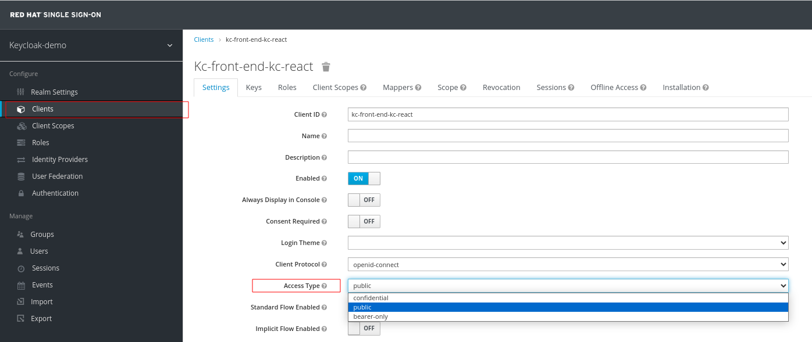
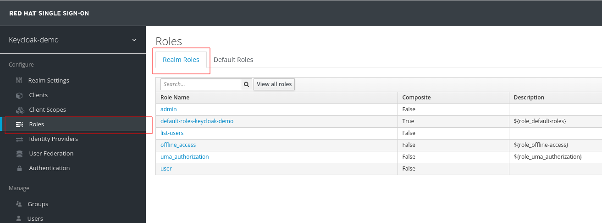
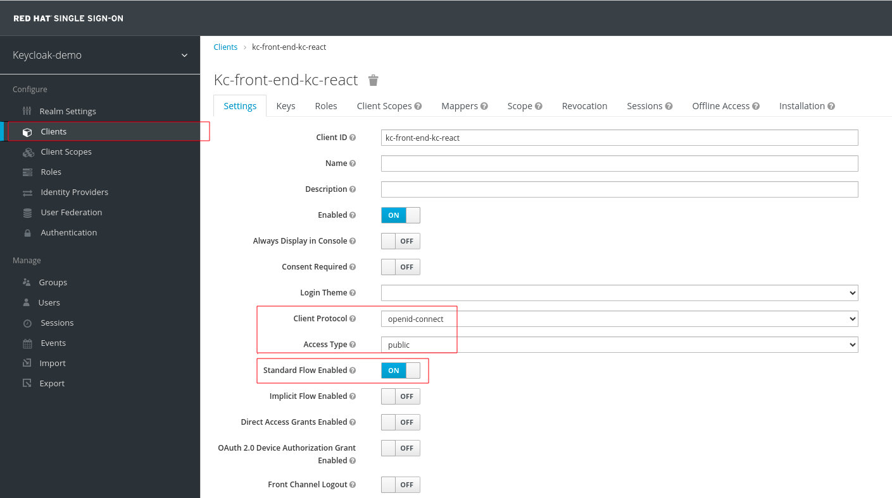
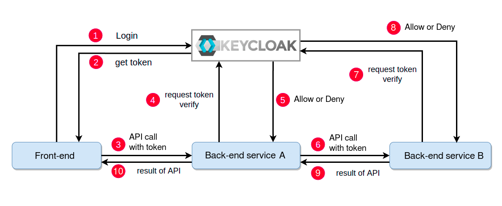

# <a name="_4b0ws9xh4uh7"></a>**RHSSO Configuration guide (for applications)**

##### October 2023
---------------------------------------------------------------

This guide starts from the point where the **Red Hat SSO**(RHSSO) server is up and running.

Note that the RHSSO server wraps another product named **Keycloak**, so further explanations will be provided as interaction with Keycloak for simplicity. 

## <a name="_eo65nss1zybc"></a>**Terminology**
Before diving into the code, let’s overview some definitions that are required for better understanding of authentication/authorization mechanisms and flows, which in turn will be reflected in coding approaches.
### <a name="_tyx68z8nm5m1"></a>Realm
A realm is a namespace in which several types of entities can be defined, the most prominent being: Users, Roles, Clients, Tokens, Groups, Identity Providers.

The realm may be created by direct creation or imported from definition in JSON format.

Create realm (direct):


Create Realm (import):


### <a name="_lw1mvxslii8u"></a>Token
The tokens may contain information about user identity(authentication) and/or its access rights(authorization). Each token has an expiration date, hence it needs to be “refreshed” by some period of time. This can be configured in realm in many ways using the following page:


### <a name="_kqkwmthnxq0w"></a>Authorization flows (Grant Type)
The OAuth 2.0 protocol describes four possible authorization flows while each of them has a particular use case. 
The Keycloak defines these flows by its own names:


|**OAuth 2.0**|**Keycloak**|
| :-: | :-: |
|Authorization Code Grant|Standard Flow|
|Implicit Grant|Implicit Flow|
|Resource Owner Password Credentials Grant|Direct Access Grants|
|Client Credentials Grant|Service Accounts|

- **Authorization Code Grant(Standard Flow):** typically used by server side applications.

- **Implicit Grant(Implicit Flow):** used by mobile or web applications(e.g: SPA), or by any other applications that run on the user's device (User Agent).
  In this flow, the Access Token is passed on to the User Agent, *potentially making the Access Token accessible to unauthorized parties*. Its use is valid, but not recommended and where possible you should use the *Authorization Code Grant* with Proof Key for Code Exchange (PKCE), which is an extension of the Authorization Code Grant and described in a separate specification (RFC 7636).

- **Resource Owner Password Credentials Grant(Direct Access Grants):** used by applications considered highly secure (trusted) since the user's credentials pass through the application itself. It is typically used in legacy or migration applications. 
  The specification itself says in paragraph 10.7 that it is an *anti‑pattern* compared to what the protocol itself tries to avoid: the user must grant his credentials to the client who will impersonate him.

- **Client Credentials Grant(Service Accounts):** used for API access through machine-to-machine(M2M) interaction.


### <a name="_bmj3xja4u5wb"></a>Keycloak client
Clients may be created by direct creation or imported from definition in JSON format as following:

- **Create client (direct)**


In the next screen the following client properties will be set:

1. Client ID: the name of client.
1. Client protocol: choose “openid-connect” or “saml”.
1. Root URL: if defined, all application redirect URLs will be resolved relative to this value,

if left empty, the absolute URL redirect paths of the application must be specified later. 

1. Save the changes.

- **Create client (import)**

  The client may be created by importing its definition from a JSON file, see step 5 on the screen of above. 
### <a name="_mjiw3l66l0ve"></a>Access Type
Once a client was created in the previous section it is time to define itt access type.

Client Access Type may be one of three possible values: Bearer-only, Confidential, Public.

The corresponding value may be selected as following: 



### <a name="_vpwlf8wqc5o7"></a>Valid Redirect URIs
This is the URI pattern (one or more) which the browser can redirect to after completing the login process. Important to mention a key steps in configuration of Redirect  URL setting:

1. Valid Redirect URL - in example below, the absolute value is used (<http://localhost:5000/*>) while the “Root URL” value is left empty.
1. Root URL - in example below, the value is not used, however, it possible to modify the example in order to get the same results by using “Root URL” value as following:
   1. Root URL = [http://localhost:5000](http://localhost:5000/*)
   1. Valid Redirect URL = [/*](http://localhost:5000/*)
1. Add or remove URL.


### <a name="_p1co5ehs9eih"></a>
### <a name="_kfvr2y9ayb5f"></a>Web Origins
Governs CORS(Cross-Origin Resource Sharing) requests.
The client makes a request to a server whose origin is different from that of the client.

In order to make a CORS request, the client does not have to do anything, it simply launches the request. The browser makes the request and it is the server that must respond if it accepts requests from that origin. It does this by sending the Access-Control-Allow-Origin header response. This header can have an asterisk (\*) or a specific origin. The \* means that the server accepts requests from any origin.

However, in the real world, accepting requests from any origin may provoke security flaws, so the following screen intends to provide a CORS fine graining related to the application needs:


### <a name="_4whgdkq2o1ip"></a>Client configuration 
Configuration to use within the application. It can be obtained from the Installation tab of Keycloak client configuration. Just go to the Installation tab and select Keycloak OIDC JSON as the format. Note that other formats like XML are provided as well:


### <a name="_u29dsx6c52ds"></a>Scopes & Claims
**Client scope** - is a way to manage the roles that get declared inside an access token. When a client requests that a user be authenticated, the access token they receive back will only contain the role mappings you’ve explicitly specified for the client’s scope. 

Client scopes definitions are shared between multiple clients.

**Default Client Scopes** - are the same as regular Client scope, but added automatically to each created client.
### <a name="_mjukgbyncgr8"></a>Roles & Groups
- **Role** - define a type or category of user associated with some permission. Admin, user, manager, and employee are all typical roles that may exist in an organization. Applications often assign access and permissions to specific roles rather than individual users as dealing with users can be too fine grained and hard to manage.
  The roles may be of three types: 
- ***Realm roles*** - roles are a global over a Realm.

  

- ***Client roles*** -  dedicated to a client.

  

- ***Composite roles*** - has one or more additional roles associated with it.

  The role composition can be achieved in a number of different ways as follows: 

  **From group relationships**

  

  **From client relationships**

  


- **Group** - a collection of users that you can apply roles and attributes to in one place. 

  

  **Default groups** - when defined, each new user will automatically join.

  

  **Group membership** - Users can be members of zero or more groups:

  

  **Group membership** - Users inherit the attributes and role mappings assigned to each group:

    

&nbsp;  
&nbsp;

## <a name="_z9ek1o3we79a"></a>**Getting started** 
---------------------------------------------------------------

### <a name="_3h6mov8tmpij"></a>The workflows
The section describes *relations* between application architecture, workflow and Keycloak client types, Roles, etc.

**Keycloak client types:**

|Application type<br>(use)|Authorization flow <br>(Grant Type)|Keycloak client<br>(Access Type)|Notes|
| :-: | :-: | :-: | :-: |
|Mobile or web applications (SPA)|Implicit Grant|Public|userName and password => token|
|Legacy monolith|Resource Owner Password Credentials Grant|Public|userName and password => access token|
|API gateways or M2M interaction|Client Credentials Grant|Confidential|Client ID and secret|
|API gateways or Server side applications|Authorization Code Grant|Bearer-only|Bearer token|


**The Keycloak Realm overview:**

**Groups** - defined as generic groups in the Realm (not an Active Directory group).  
Each group is associated with one or more roles as following: 
- The  “user-grp” group is associated with the “user” role.
- The “admin-grp” group is associated with “admin” and “user” roles.

**Roles** -  the following roles are defined in Ream: user, admin.  
Each client defines its own roles such as user, admin, while they may be associated(or not) with the realm roles user, admin. In that case the role is defined as “composite role”. There are  some special roles such as view-users, query-groups that are defined as roles in service accounts for clients *kc-back-end-kc-protected-m2m-service*, *kc-back-end-kc-protected-m2m-service-with-service-account*.

**Users** - defined as  generic users in the Realm (not Active Directory users).  
Each user is associated with one or more groups in turn associated with roles.  
The realm user are defined as following:  
- The  user1, user2 are associated with the “user-grp” group(“user” role).  
- The user3 is associated with the “admin-grp” group (“admin” and “user” roles).  

**Clients** - are aggregate roles(Realm roles,Client roles) in order to define protection levels. 
In some cases, clients has a service accounts(see the “service-account\*” in schema below) associated with special roles from other Keycloak clients (realm-management) in order to interact with Keycloak REST API.  


The relations between a components of realm described avobe, represented by following schema: 


#### <a name="_y8u0q3z3pa6q"></a>Workflow: Web application (Front-end)

**Case:**  application which consists of a front-end application and the back-end service. The authentication is done via Keycloak. The workflow looks like the following: 

- The user logs into the frontend(browser) and gets a token from Keycloak.
- This token is sent to the backend with every request.
- The back-end uses a token to request the Keycloak for client authentication and  the authorization(when defined) for the requested resource. In case of failure, respond with the “access denied” to the client(HTTP code 403 - forbidden).


Keycloak clients used in workflow:

|**Keycloak client type**|**Keycloak client name**|**Application**|
| :- | :- | :- |
|public|kc-front-end-kc-react|kc-front-end/kc-react|
|bearer-only|kc-back-end-kc-protected-service|kc-back-end/kc-protected-service|

Important highlights on Keycloak clients:

Public client (kc-front-end-kc-react)




Bearer-only  client (kc-back-end-kc-protected-service)


**Case:** application which consists of a frontend and several back-end services. The backend consists of the back-end service A (protected) and  the back-end service B (unprotected).The authentication is done via Keycloak. The workflow looks like the following: 

- The user logs into the frontend and gets a token from Keycloak.
- This token is sent to the backend with every request.
- The back-end service A uses a token to request the Keycloak for client authentication and  the authorization(when defined) for the requested resource and in case of success, forwards the request without token to the unprotected back-end. In case of failure, respond with the “access denied” to the client(HTTP code 403 - forbidden).
- The back-end serves the client request on and returns a response to the API gateway.
- The back-end service A transfer response from the **unprotected** back-end service B to the client.


Keycloak clients used in workflow:

|**Keycloak client type**|**Keycloak client name**|**Application**|
| :- | :- | :- |
|public|kc-front-end-kc-react|kc-front-end/kc-react|
|bearer-only|kc-back-end-kc-protected-service|kc-back-end/kc-protected-service|
|-|-|kc-back-end/kc-unprotected-service|

#### <a name="_us7ct1e5t42e"></a>Workflow: Machine to machine communication(M2M)

With machine-to-machine (M2M) applications, such as CLIs, daemons, or services running on the back-end, the system authenticates and authorizes the application rather than a user. For this scenario, typical authentication schemes like username with password or social logins do not make sense. 
For that purpose the Keycloak implements “service accounts” which supports the simple idea that a service account is just a machine user. Note that the service accounts don’t show up on user searches, hence, no user information can be accessed. For that reason, in order to communicate with each other, the applications pass along their Client ID and Client Secret to authenticate themselves and get a token.

Remember, that the following Keycloak client types may be used in M2M interaction:

- Confidential (when “Implicit Flow Enabled” is OFF)
- Bearer-only

The decision which type of client to use may be driven by pros and cons of each by following:

||Pros|Cons|
| :- | :- | :- |
|Bearer-only|Setup simplicity|- Less authorization options|
|Confidential|- Service Account ability.<br>- Fine grained authorization|When “Implicit Flow Enabled” is ON and there is no option to change it (externally managed)|


The following example illustrates the use of a “confidential client” with a “service account” on back-end service. In the given scenario, the front-end application has its own “public client” which accesses the back-end service with a “confidential client” using a token. When the access is granted, the back-end is trying to make a call to Keycloak API in order to get some resources.

Here the Keycloak API call represents interaction with another service, as an example of M2M interaction between the back-end service and API server. It requires *an additional token* that must be obtained by the back-end for the “service account” user from Keycloak and used for interaction with the it’s API:


Keycloak clients used in workflow:

|**Keycloak client type**|**Keycloak client name**|**Application**|
| :- | :- | :- |
|public|kc-front-end-kc-react|kc-front-end/kc-react|
|confidential|kc-back-end-kc-protected-m2m-service-with-service-account|kc-back-end/kc-protected-sa-service|

**The Service account setup.**

In order to use the Service account it must be enabled first.
When the switch “Service Accounts Enabled” is set to “ON”, then a new tab “Service Accounts Roles” appears. This tab allows to configure the service account according to application requirements:


**The M2M interaction closeup.**

From technical point of view, the token is passed by “Authorization” header in HTTP request between machines with each other as following: 
['Authorization'] = 'Bearer ' + token;


**Case:** application which consists of a front-end and several back-end services. The following client types are used for  the given case:

- Front-End: public client
- Back-end “service A”: Bearer-only client 
- Back-end “service B”: Confidential client

The Keycloak authentication workflow looks like the following: 

- The user logs into the front-end and gets a token from Keycloak.
- This token is sent to the back-end “service A” with every request using the HTTP header as follows: ['Authorization'] = 'Bearer ' + token;
- The back-end “service A” uses a token from the front-end to request the Keycloak for client authentication and  the authorization(when defined) for the requested resource and in case of success, forwards the request with a token to the other protected back-end “service B”. In case of failure, respond with the “access denied” to the client(HTTP code 403 - forbidden).
- The back-end “service B” uses a token from “service A” to request the Keycloak for client authentication and  the authorization(when defined) for the requested resource and in case of success, serves the request and return response. In case of failure, respond with the “access denied” to the client(HTTP code 403 - forbidden). 
- The back-end “service A” receives a response from “service B” and returns a response to the front-end application.
- The front-end application receives a response from the **protected** back-end(s).



NOTE: As a more common case, The back-end “service B” may forward requests to some other service with or without a token depending if the service is protected or not.

Keycloak clients used in workflow:

|**Keycloak client type**|**Keycloak client name**|**Application**|
| :- | :- | :- |
|public|kc-front-end-kc-react|kc-front-end/kc-react|
|bearer-only|kc-back-end-kc-protected-service|kc-back-end/kc-protected-service|
|confidential|kc-back-end-kc-protected-m2m-service|kc-back-end/kc-protected-m2m-service|

Important highlights on Keycloak clients:

### <a name="_wuodotk3x2tv"></a>Oauth2 Proxy - The alternative (code-free) workflow
#### <a name="_cuedlvgogitg"></a>Workflow: Web application with Front-end and/or Backend

**Case:**  application which consists of a following:

- The front-end application and the back-end service. 
- The front-end application only
- The back-end service only.

As in cases above, the authentication is done via Keycloak, however with the help of a small  reverse proxy that provides authentication using Keycloak as a provider.  
The workflow looks like the following: 

Browser based flow:

1\. The user is browsing to the URL of Oauth2 Proxy server with credentials in order to initialize the login process to the Keycloak server.  
2\. When credentials are valid, Oauth2 proxy makes a redirect to its upstream service(back-end or  front-end).  
3\. This token is saved as cookie(default setting) while Oauth2 Proxy server uses it within every request to the upstream service.  


**NOTE:** The purpose of NGINX in the flow is to provide support for SSL, CORS handling etc.

There is no coding required, only definitions in Keycloak and Oauth2 Proxy server.
These definitions goes as following:

**Keycloak settings:**

|**parameter**|**value**|**notes**|
| :- | :- | :- |
|Client type|confidential|Bearer-only may be used for M2M flow|
|Redirect URL|<oauth2-proxy-host>:4180/oauth2/callback||
|Web Origins|\*|Cors handling|


**Oauth2 Proxy settings:**
The oauth2-proxy-v7.5.1.linux-amd64 version is used for this demo.

Assuming the oauth2-proxy is running on localhost, port 4180, the settings may look like following:

```bash
keycloak\_host='localhost'
keycloak\_port='8080'
realm\_name='sso-demo-3'
client\_id='oauth2proxy-back-end-service'
client\_secret='Y95Nq6XyEXyPvSytov8rt95GEfmRZJxN'
keycloak\_base\_url="http://${keycloak\_host}:${keycloak\_port}/auth/realms/${realm\_name}/protocol/openid-connect"
oauth2p\_host=localhost
oauth2p\_port=4180
redirect\_url="http://localhost:4180/oauth2/callback"
upstream\_url='http://localhost:3004/api/user,http://localhost:3004/api/admin'
```

Then, the command-line is like following:

```bash
./oauth2-proxy \
--provider=keycloak-oidc \
--set-xauthrequest=true	\
--auth-logging=true \
--pass-authorization-header=true \
--set-xauthrequest=true \
--request-logging=true \
--client-id="${client\_id}" \
--client-secret="${client\_secret}" \
--cookie-secret="${client\_secret}" \
--redirect-url="${redirect\_url}" \
--upstream="${upstream\_url}" \
--oidc-issuer-url="http://${keycloak\_host}:${keycloak\_port}/auth/realms/${realm\_name}" \
--email-domain=\* \
--show-debug-on-error="true" \
--pass-user-headers="true" \
--skip-jwt-bearer-tokens="false" \
--skip-provider-button="true" \
--skip-auth-preflight="true" \
--pass-access-token="true" \
--code-challenge-method=S256 \
--whitelist-domain="localhost:5000 localhost:3004 localhost:4180 localhost:8081 locahost:8080" \
--session-store-type="cookie" \
--cookie-expire="5m" \
--cookie-refresh="3m" \
--scope="openid roles profile email" \
--oidc-extra-audience="aud-mapper-oauth2proxy-back-end-service" \
--insecure-oidc-allow-unverified-email="true" \
--cookie-samesite="none" \
--reverse-proxy="true"
```

In case when user groups used, the following parameters should be in use:

```bash
./oauth2-proxy \
....
--keycloak-group=<first\_allowed\_user\_group> \
--keycloak-group=<second\_allowed\_user\_group> \
....
```
