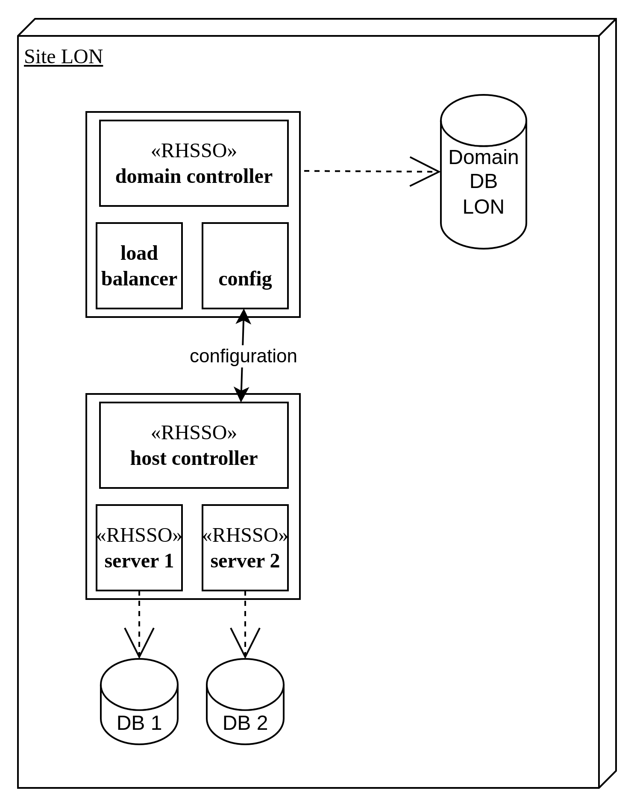
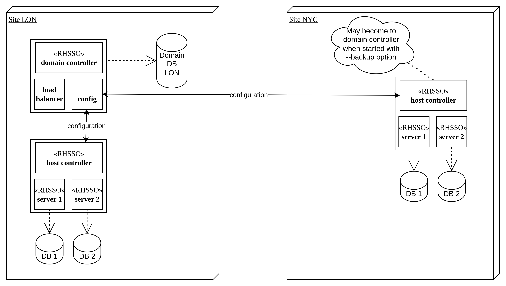
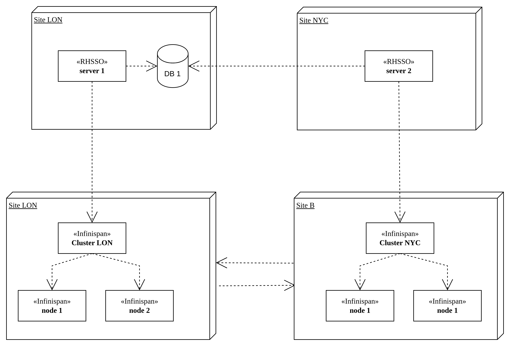
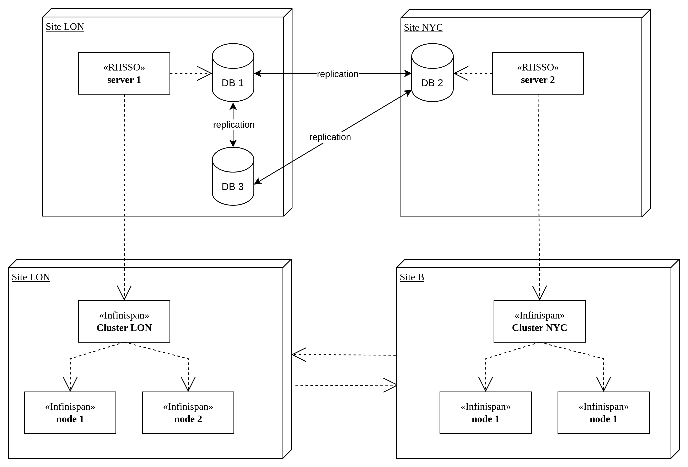
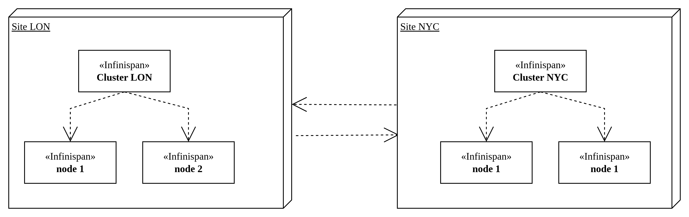

# Red Hat Single Sign-On (RHSSO) High-Availability

### 1. **Introduction**

This tutorial walks you through setting up a Red Hat Single Sign-On (RHSSO) high-availability (HA) in various configurations to meet different operational needs. We cover configurations that range from centralized management to high availability with external caching and database setups. Specifically, you will learn how to configure RHSSO in the following ways:

#### **Domain Mode**

Centralized management that allows control of multiple RHSSO servers from a single point, simplifying administration and deployment within a site.

  - **Pros**: Simplifies configuration and management for multiple RHSSO instances within the same site.
  - **Cons**: Does not support cross-site synchronization, limiting configuration consistency to within a single site.

#### **High Availability (HA) Mode with External Infinispan and Shared PostgreSQL Database**

This configuration splits the RHSSO cluster across two sites. It uses an external Infinispan cache for distributed caching and a shared PostgreSQL database for persistent data storage. HAProxy is employed as the load balancer to efficiently distribute traffic across the RHSSO nodes, ensuring high availability and fault tolerance.

  - **Pros**: Provides robust session replication and high availability across sites with a centralized database ensuring consistent state.
  - **Cons**: The shared database can be a single point of failure and might require strong network performance for efficient cross-site operations.

#### **High Availability (HA) Mode with External Infinispan and Multi-Master MariaDB/Galera Cluster**

Similar to the previous setup, but it uses a multi-master MariaDB/Galera cluster for database replication and redundancy across multiple nodes. This configuration ensures that each site has an up-to-date copy of the data, enhancing resilience and availability. HAProxy handles load balancing to maintain optimal performance.

  - **Pros**: Ensures high availability and resilience with replicated data accessible from any site, avoiding single points of failure.
  - **Cons**: Setup and management are more complex, especially regarding maintaining data consistency and resolving conflicts across multiple nodes.

#### **Addressing Cross-Site Configuration Challenges**

In a cross-site Infinispan cluster deployment, the primary objective is to achieve RHSSO session replication across multiple sites, ensuring that user sessions are available even if one site goes offline. However, while each RHSSO server maintains a local database it is not synchronized with other sites, configuration changes (like realms, users, etc.) are not replicated across sites, leading to inconsistency.

To tackle these challenges and improve configuration consistency across multiple sites, consider the following advanced deployment strategies:

**Shared Database Setup**: Uses a centralized PostgreSQL database shared among all RHSSO servers, ensuring synchronized configuration changes across sites.

  - **Pros**: Centralized configuration management, providing a consistent and unified state across all sites.
  - **Cons**: The centralized database can become a single point of failure and requires robust network and database performance to handle cross-site interactions efficiently.

**Multi-Master Database Replication**: Deploys a multi-master MariaDB/Galera cluster to synchronize databases across sites, ensuring up-to-date configuration data and making the system resilient and consistent across locations.

  - **Pros**: Offers high availability and fault tolerance, with configuration data replicated and accessible from any site, avoiding single points of failure.
  - **Cons**: Complex setup and management, particularly in maintaining consistency and handling conflict resolution among nodes in the multi-master setup.

**RHSSO Domain Mode**: In domain mode a central domain controller manages configurations for all RHSSO instances within the site. This approach _partially_ addresses configuration issues by ensuring consistency within the site.

  - **Pros**: Simplifies configuration management within a site, with centralized control over multiple RHSSO instances.
  - **Cons**: Limited to single-site deployments as it does not provide cross-site configuration synchronization.

### 2. **Prerequisites**

- Podman or Docker installed on your system.
- Access to the following container images:

| **component** | **repository** | **Image (docker pull)** | **tag** | **version** |
| --- | --- | --- | --- | --- |
| RHSSO | registry.redhat.io/rh-sso-7 | [sso76-openshift-rhel8](http://registry.redhat.io/rh-sso-7/sso76-openshift-rhel8:7.6-23) | 7.6-23 | v7.6.3 |
| HAProxy | docker.io/library | [haproxy](http://docker.io/library/haproxy:latest) | latest | v3.0.0 |
| Infinispan | quay.io/infinispan | [server](http://quay.io/infinispan/server:11.0.14.Final) | 11.0.14.Final | v11.0.14 |
| PostgreSQL | registry.redhat.io/rhel8 | [postgresql-13](http://registry.redhat.io/rhel8/postgresql-13:latest) | latest | v13 |
| MariaDB | docker.io/library | [mariadb](http://docker.io/library/mariadb:10.11) | 10.11 | v10.11 |

- Access to the following libraries:
  - **perl-DBD-MySQL**: Facilitates MySQL database operations via Perl's DBI (Database Interface) framework, enabling the execution of SQL queries and interaction with MySQL databases from Perl scripts.
  - **libev**: Provide efficient and scalable event-driven programming for network and I/O-bound applications, commonly used in applications that require handling many simultaneous connections.
  - **mariadb-java-client**: A JDBC driver that provides connectivity to MariaDB and MySQL databases.
  - **postgresql-42.7.3.jar**: A JDBC driver for PostgreSQL database.
- The links to resources provided as follows:

| **library** | **repository** | **RPM** | **version** |
| --- | --- | --- | --- |
| perl-DBD-MySQL |     | [perl-DBD-MySQL-5.006-2.fc41.aarch64.rpm](https://www.rpmfind.net/linux/fedora/linux/development/rawhide/Everything/aarch64/os/Packages/p/perl-DBD-MySQL-5.006-2.fc41.aarch64.rpm) | 5.006-2 |
| libev | [libev-4.33.tar.gz](http://dist.schmorp.de/libev/libev-4.33.tar.gz) |     | 4.33 |
| mariadb-java-client | [mariadb-java-client-3.4.0.jar](https://repo1.maven.org/maven2/org/mariadb/jdbc/mariadb-java-client/3.4.0/mariadb-java-client-3.4.0.jar) |     | 3.4.0 |
| postgresql | [postgresql-42.7.3.jar](https://repo1.maven.org/maven2/org/postgresql/postgresql/42.7.3/postgresql-42.7.3.jar) |     | 42.7.3 |

- Access to the Dockerfiles and configuration files:

###

### 3. **Configuration Management in Clustered Deployments**

When deploying Red Hat Single Sign-On (RHSSO) or Keycloak servers in a clustered environment, effective management of configuration data is essential. While **Infinispan** plays a critical role in such setups by facilitating the consistent replication of session data across cluster nodes, it does not handle the replication of configuration data. Configuration data in RHSSO is typically stored in a database, and synchronizing this data across all nodes requires additional strategies.

#### **Database Replication:**

The traditional approach to synchronize configuration data in a cluster is through **database replication**. This involves copying and synchronizing the database that stores the configuration data across multiple nodes. There are various architectures for database replication, such as **Active/Passive** or **Active/Active** configurations, each with its own set of complexities.

- **Pros:** Directly ensures that all configuration data is consistently available across all nodes in the cluster.
- **Cons:** Setting up and maintaining database replication can be complex and resource-intensive, especially in scenarios requiring high availability and conflict resolution, such as Active/Active configurations.

#### **GitOps as an Alternative Approach:**
  To circumvent the complexities associated with database replication, the **GitOps** methodology offers a modern alternative. In a GitOps approach, the configuration of RHSSO servers is managed through a version control system like GitHub or GitLab. Configuration changes are committed to a repository, and a CI/CD pipeline is triggered to propagate these changes to all nodes in the cluster
  **Pros:** Simplifies configuration management by avoiding the need for intricate database replication setups. Ensures consistent, automated, and auditable configuration deployments across multiple sites
  **Cons:** Requires a robust CI/CD pipeline and familiarity with GitOps tools and methodologies. Implementing GitOps can be complex and requires additional resources for setup and maintenance. It also necessitates careful handling of the deployment process to ensure configurations are **reloaded gracefully**


### 4. **Domain Mode**

Setting up RHSSO in domain mode involves configuring a domain controller and several host instances (slaves) that are managed by the domain controller. This setup allows centralized management of configurations and deployments across multiple RHSSO instances.

The simplified domain-mode deployment looks like following:


#### 4.1. **Domain Controller (Master Node)**

Domain/Host Controller Configuration. The following command starts the RHSSO in domain mode using the domain.xml configuration file. It specifies the host-master.xml configuration for the master node and binds the management address and host name to rh-sso-domain-ctl, listening on port 9990.

```bash
$JBOSS_HOME/bin/domain.sh -c domain.xml --host-config=host-master.xml \
-Djboss.bind.address.management=rh-sso-domain-ctl \
-Djboss.host.name=rh-sso-domain-ctl \
-Djboss.management.http.port=9990
```

#### 4.2 **Host Instances (Slave Nodes)**
The following command starts a host instance as a slave node using the host-slave.xml configuration. It connects to the domain controller (rh-sso-domain-ctl) and specifies its own bind address and host name as rh-sso-server-slave1.
```bash
$JBOSS_HOME/bin/domain.sh --host-config=host-slave.xml --cached-dc \
-Djboss.domain.master.address=rh-sso-domain-ctl \
-Djboss.bind.address=rh-sso-server-slave1 \
-Djboss.host.name=rh-sso-server-slave1 \
-Djboss.domain.master.port=9990
```


#### 4.3 **Configuration Files**

1. **domain.xml**: This file typically contains the overall configuration for the domain, including profiles, server groups, and deployment settings. It is used by both the domain controller and the slave nodes to understand how the entire domain is structured.
2. **host-master.xml**:
    - **Domain Controller Configuration**: The configuration in host-master.xml specifies that the domain controller operates locally. This setting means the master node is responsible for managing the domain without any external domain controllers.
    ```xml
    <domain-controller>
      <local/>
    </domain-controller>
    ```

3. **host-slave.xml**:
    - **Host Instance (Slave) Configuration**: This section of the host-slave.xml file defines two server instances (rh-sso-server-slave0 and rh-sso-server-slave1). Each server is associated with the auth-server-group and configured to auto-start. The port-offset parameter adjusts the base ports for each server to prevent conflicts, with the first server using a port offset of 0 and the second using a port offset of 250.

    ```xml
    <server name="rh-sso-server-slave0" group="auth-server-group" auto-start="true">
      <jvm name="default"/>
      <socket-bindings port-offset="0"/>
    </server>
    <server name="rh-sso-server-slave1" group="auth-server-group" auto-start="true">
      <jvm name="default"/>
      <socket-bindings port-offset="250"/>
    </server>
    ```


#### **4.4 Network configuration**

First, create a dedicated network for RHSSO components.
```bash
podman network create rh-sso-net
```

#### 4.5 **Database configuration**

PostgreSQL Setup - Build and run a PostgreSQL container for Keycloak:

- **Build the PostgreSQL Image:**

  ```bash
  podman build -t keycloak-db -f Containerfile-postgresql13 \
  --build-arg DB_ADMIN_PASSWD=admin \
  --build-arg DB_PASSWD=sa \
  --build-arg DB_USER=sa \
  --build-arg DB_NAME=keycloak .
  ```

- **Run the PostgreSQL Container:**

  ```bash
  podman run -it --rm --name rh-sso-db -p 5432:5432 \
  -v $PWD/dbdata:/var/lib/pgsql/data:Z \
  --network=rh-sso-net \
  keycloak-db:latest
  ```


#### 4.6 **RHSSO(Keycloak) setup**

- **Build the Domain Controller Image**

```bash 
  podman build -t keycloak-server -f Containerfile .
```

- **Run the Domain Controller Container**

```bash  
podman run --rm --name rh-sso-domain-ctl \
-p 8778:8778 -p 8080:8080 -p 8443:8443 -p 8888:8888 -p 9990:9990 \
-e SSO_HOSTNAME=localhost \
-e SSO_ADMIN_USERNAME=admin \
-e SSO_ADMIN_PASSWORD=admin \
-e SSO_REALM=test \
-e HTTPS_KEYSTORE_DIR=/etc/keystore \
-e HTTPS_KEYSTORE=keystore.jks \
-e HTTPS_KEYSTORE_TYPE=jks \
-e HTTPS_NAME=jboss \
-e HTTPS_PASSWORD=secret \
-e JGROUPS_ENCRYPT_KEYSTORE_DIR=/etc/jgroups \
-e JGROUPS_ENCRYPT_KEYSTORE=jgroups.jceks \
-e JGROUPS_ENCRYPT_NAME=secret-key \
-e JGROUPS_ENCRYPT_PASSWORD=secret \
-e JGROUPS_CLUSTER_PASSWORD=random \
-e SSO_TRUSTSTORE=truststore.jks \
-e SSO_TRUSTSTORE_DIR=/etc/truststore \
-e SSO_TRUSTSTORE_PASSWORD=secret \
-v $PWD/keystore:/etc/keystore:Z \
-v $PWD/jgroups:/etc/jgroups:Z \
-v $PWD/truststore:/etc/truststore:Z \
--network=rh-sso-net \
keycloak-server
```

- **Build the Domain Controller Image**

```bash
podman build -t keycloak-server-node -f Containerfile-host-slave .
```
- **Run the Domain Controller Container**

```bash
podman run --rm --name rh-sso-server-slave1 \
--network=rh-sso-net \
keycloak-server-node
```

#### 4.7 **The Cross-site challenge in domain mode**

Starting a host controller with the **--backup** option allows it to store a backup of the domain configuration. In the event of a domain controller (DC) failure, this host controller can then be promoted to act as the DC by starting it with the **--cached-dc** option. However, there is no hot-standby feature for automatic DC failover.

The following schema illustrates deployment in domain mode:




### 5. **High Availability (HA) Mode with External Infinispan and Shared PostgreSQL Database**

#### 5.1 **Network configuration**

First, create a dedicated network for RHSSO components.

```bash
podman network create infinispan_mynetwork
```

#### 5.2 **RHSSO(Keycloak) setup**

For high availability, we will set up two RHSSO(Keycloak server) instances.

- **PROXY_ADDRESS_FORWARDING** is set to **true** when we run keycloak behind a reverse proxy. Without this variable set to **true,** we can’t log in to our keycloak server.




##### **Server 1**

- **Build the RHSSO(Keycloak) “Server 1” Image:**

```bash
podman build -t keycloak-host-ha1:7.6.3 -f Containerfile-ha1 .
```

- **Run the RHSSO(Keycloak) “Server 1” Container:**

```bash
podman run --rm \
--name rh-sso-server-ha1 \
--network=infinispan_mynetwork \
--hostname=rh-sso-server-ha1 \
-p 8444:8444 \
-p 9029:9029 \
-p 8081:8081 \
-p 8331:8331 \
-p 8694:8694 \
-p 9139:9139 \
-p 10241:10241 \
-p 9991:9991 \
-e PROXY_ADDRESS_FORWARDING=true \
-e KEYCLOAK_ADMIN=admin \
-e KEYCLOAK_ADMIN_PASSWORD=admin \
-e SSO_HOSTNAME=localhost \
-e SSO_ADMIN_USERNAME=admin \
-e SSO_ADMIN_PASSWORD=admin \
-e SSO_REALM=test \
-e HTTPS_KEYSTORE_DIR=/etc/keystore \
-e HTTPS_KEYSTORE=keystore.jks \
-e HTTPS_KEYSTORE_TYPE=jks \
-e HTTPS_NAME=jboss \
-e HTTPS_PASSWORD=secret \
-e JGROUPS_ENCRYPT_KEYSTORE_DIR=/etc/jgroups \
-e JGROUPS_ENCRYPT_KEYSTORE=jgroups.jceks \
-e JGROUPS_ENCRYPT_NAME=secret-key \
-e JGROUPS_ENCRYPT_PASSWORD=secret \
-e JGROUPS_CLUSTER_PASSWORD=random \
-e SSO_TRUSTSTORE=truststore.jks \
-e SSO_TRUSTSTORE_DIR=/etc/truststore \
-e SSO_TRUSTSTORE_PASSWORD=secret \
-v $PWD/keystore:/etc/keystore:Z \
-v $PWD/jgroups:/etc/jgroups:Z \
-v $PWD/truststore:/etc/truststore:Z \
keycloak-host-ha1
```

##### **Server 2**

- **Build the Keycloak Server 2 Image:**

```bash  
podman build -t keycloak-host-ha2:7.6.3 -f Containerfile-ha2 .
```

- **Run the Keycloak Server 2 Container:**

```bash  
podman run --rm \
--name rh-sso-server-ha2 \
--network=infinispan_mynetwork \
--hostname=rh-sso-server-ha2 \
-p 8082:8082 \
-p 8780:8780 \
-p 8445:8445 \
-p 8890:8890 \
-p 9992:9992 \
-e PROXY_ADDRESS_FORWARDING=true \
-e KEYCLOAK_ADMIN=admin \
-e KEYCLOAK_ADMIN_PASSWORD=admin \
-e SSO_HOSTNAME=localhost \
-e SSO_ADMIN_USERNAME=admin \
-e SSO_ADMIN_PASSWORD=admin \
-e SSO_REALM=test \
-e HTTPS_KEYSTORE_DIR=/etc/keystore \
-e HTTPS_KEYSTORE=keystore.jks \
-e HTTPS_KEYSTORE_TYPE=jks \
-e HTTPS_NAME=jboss \
-e HTTPS_PASSWORD=secret \
-e JGROUPS_ENCRYPT_KEYSTORE_DIR=/etc/jgroups \
-e JGROUPS_ENCRYPT_KEYSTORE=jgroups.jceks \
-e JGROUPS_ENCRYPT_NAME=secret-key \
-e JGROUPS_ENCRYPT_PASSWORD=secret \
-e JGROUPS_CLUSTER_PASSWORD=random \
-e SSO_TRUSTSTORE=truststore.jks \
-e SSO_TRUSTSTORE_DIR=/etc/truststore \
-e SSO_TRUSTSTORE_PASSWORD=secret \
-v $PWD/keystore:/etc/keystore:Z \
-v $PWD/jgroups:/etc/jgroups:Z \
-v $PWD/truststore:/etc/truststore:Z \
keycloak-host-ha2
```

### 6. **HA Mode with External Infinispan and Multi-Master MariaDB/Galera Cluster**



#### 6.1 **Network configuration**
First, create a dedicated network for RHSSO components.

```bash
podman network create infinispan_mynetwork
```

#### 6.2 **Database configuration**

MariaDB Setup. Set up a 3-node MariaDB cluster:

##### **Node 1 setup**

```bash
podman run --name mariadb-0 --rm \
-v $PWD/mariadb-node-0/etc/mysql.conf.d:/etc/mysql/conf.d:Z \
-v $PWD/mariadb-node-0/data:/var/lib/mysql:Z \
-e MYSQL_INITDB_SKIP_TZINFO=yes \
-e MYSQL_ROOT_PASSWORD=my-secret-pw \
-p 3306:3306 -p 4567:4567/udp -p 4567-4568:4567-4568 -p 4444:4444 \
--hostname=mariadb-node-0 \
--network=infinispan_mynetwork \
mariadb:10.11 \
--wsrep-new-cluster --wsrep_node_address=mariadb-node-0
```

##### **Node 2 setup**

```bash
podman run --name mariadb-1 --rm \
-v $PWD/mariadb-node-1/etc/mysql.conf.d:/etc/mysql/conf.d:Z \
-v $PWD/mariadb-node-1/data:/var/lib/mysql:Z \
-e MYSQL_INITDB_SKIP_TZINFO=yes \
-e MYSQL_ROOT_PASSWORD=my-secret-pw \
-p 3316:3306 -p 4577:4567/udp -p 4577-4578:4567-4568 -p 4445:4444 \
--hostname=mariadb-node-1 \
--network=infinispan_mynetwork \
mariadb:10.11
```

##### **Node 3 setup**

```bash
podman run --name mariadb-2 --rm \
-v $PWD/mariadb-node-2/etc/mysql.conf.d:/etc/mysql/conf.d:Z \
-v $PWD/mariadb-node-2/data:/var/lib/mysql:Z \
-e MYSQL_INITDB_SKIP_TZINFO=yes \
-e MYSQL_ROOT_PASSWORD=my-secret-pw \
-p 3326:3306 -p 4587:4567/udp -p 4587-4588:4567-4568 -p 4446:4444 \
--hostname=mariadb-node-2 \
--network=infinispan_mynetwork \
mariadb:10.11
```

##### **Create database**

Client root password: my-secret-pw

- Connect to cluster node(mariadb-node-1):

```bash
podman run --rm -it --network=infinispan_mynetwork mariadb:10.11 mysql -h mariadb-node-1 -u root -p
```

- Create database(keycloak) and user(sa):

```bash
MariaDB [(none)]> create database keycloak;
MariaDB [(none)]> show databases;
MariaDB [(none)]> CREATE USER 'sa'@'%' IDENTIFIED BY 'sa';
MariaDB [(none)]> GRANT ALL PRIVILEGES ON \* . \* TO 'sa'@'%';
MariaDB [(none)]> FLUSH PRIVILEGES;
MariaDB [(none)]> SELECT User FROM mysql.user;
```

- Connect to database(keycloak):

```bash
podman run --rm -it --network=infinispan_mynetwork mariadb:10.11 mysql -h mariadb-node-1 -u root -p keycloak
```


### 7. **Load Balancer Configuration**

The HAProxy will be used as a load balancer for the RHSSO servers.

- **Build the HAProxy Image:**
```bash
podman build -t haproxy:latest -f Containerfile-haproxy .
```

- **Run the HAProxy Container:**

```bash
podman run --rm --name  rhsso-haproxy \
--hostname=rhsso-haproxy \
--network=infinispan_mynetwork \
-p 8080:8080 \
-v $PWD/haproxy/haproxy.cfg:/usr/local/etc/haproxy/haproxy.cfg:Z \
haproxy:latest
```

### 8. **Realm Management**

To manage RHSSO realms, you can export and import realm configurations.

- **Export Realm Configuration**

```bash
podman exec -it rh-sso-server-ha1 \
/opt/keycloak/bin/kc.sh export --file /tmp/myrealm.json --realm myrealm
```

- **Import Realm Configuration**

```bash
podman exec -it rh-sso-server-ha1 \
/opt/keycloak/bin/kc.sh import --file /tmp/myrealm.json --realm myrealm
```

### 9. **Infinispan**

This tutorial demonstrates Infinispan cross-site replication capabilities, consisting of two Infinispan clusters, LON and NY, that provide backups for each other. The clusters are built based on following resources:

| **source** | **notes** |
| --- | --- |
| [Deploying and Configuring Infinispan 11.0 Servers](https://infinispan.org/docs/11.0.x/titles/server/server.html#server_requirements) |     |
| [Download older versions of Infinispan](https://infinispan.org/download-archive) | Version 11.0.19 |
| [Cross-site replication Tutorial](https://infinispan.org/tutorials/simple/simple_tutorials.html#cross-site-replication_remote-cache-tutorials) | Infinispan |
| [Cross-site-replication Tutorial Sources](https://github.com/infinispan/infinispan-simple-tutorials/tree/main/infinispan-remote/cross-site-replication) | Infinispan |
| [Configuring distributed caches](https://www.keycloak.org/server/caching) | Keycloak |


Cross-site Infinispan cluster deployment diagram:



**Relations in deployment:** This setup ensures that data replication flows from the LON site to the NYC site, while the NYC site's data is backed up in the LON site, providing robust data consistency, availability, and performance optimization across geographically distributed deployments of Keycloak. The cache uses the Keycloak-specific HotRod marshaller for serialization, and it has specified memory and expiration settings to manage cache size and data lifetime.

For example, the Keycloak instances deployed in LON and NYC sites utilize their respective local Infinispan clusters for managing a distributed-cache named "actionTokens".

1. **LON Site Configuration:**
    - **Keycloak Cache:** Configured as a distributed-cache with ownership spread across 4 nodes (```owners="4"```).

    ```xml 
    <distributed-cache name="actionTokens" owners="4">
      <remote-store cache="actionTokens" fetch-state="false" passivation="false" preload="false"
      purge="false" remote-servers="infinispan-server-lon-1 infinispan-server-lon-2" shared="true">
        <property name="rawValues">true</property>
        <property name="marshaller">org.keycloak.cluster.infinispan.KeycloakHotRodMarshallerFactory</property>
      </remote-store>
      <heap-memory size="-1"/>
      <expiration interval="300000" lifespan="90000000" max-idle="300000"/>
    </distributed-cache>
    ```

    - **Infinispan Cache:** Also named "actionTokens", configured in SYNC mode with transactional settings optimized for non-transactional operations (```mode="SYNC"``` and ```<transaction mode="NON_XA">```). Pessimistic locking is enabled (```<locking PESSIMISTIC="true"/>```). It includes a backup configuration pointing to the NYC site for replication (```<backup site="NYC" strategy="SYNC" failure-policy="WARN"/>```).

    ```xml 
    <distributed-cache name="actionTokens" mode="SYNC" statistics="true">
      <transaction mode="NON_XA">
        <locking PESSIMISTIC="true"/>
      </transaction>
      <backups>
        <backup site="NYC" strategy="SYNC" failure-policy="WARN"/>
      </backups>
    </distributed-cache>
    ```

1. **NYC Site Configuration:**
    - **Keycloak Cache:** Similar to LON, configured as a distributed-cache with ownership spread across 4 nodes (```owners="4"```).

    ```xml 
    <distributed-cache name="actionTokens" owners="4">
      <remote-store cache="actionTokens" fetch-state="false" passivation="false" preload="false"
      purge="false" remote-servers="infinispan-server-nyc-1 infinispan-server-nyc-2" shared="true">
        <property name="rawValues">true</property>
        <property name="marshaller">org.keycloak.cluster.infinispan.KeycloakHotRodMarshallerFactory</property>
      </remote-store>
      <heap-memory size="-1"/>
      <expiration interval="300000" lifespan="90000000" max-idle="300000"/>
    </distributed-cache>
    ```

    - **Infinispan Cache:** Configured with the same name "actionTokens", in SYNC mode with transactional settings optimized for non-transactional operations (```mode="SYNC"``` and ```<transaction mode="NON_XA">```). Pessimistic locking is enabled (```<locking PESSIMISTIC="true"/>```). It includes a backup configuration pointing to the LON site for redundancy (```<backup site="LON" strategy="SYNC" failure-policy="WARN"/>```).

    ```xml 
    <distributed-cache name="actionTokens" mode="SYNC" statistics="true">
      <transaction mode="NON_XA">
        <locking PESSIMISTIC="true"/>
      </transaction>
      <backups>
        <backup site="LON" strategy="SYNC" failure-policy="WARN"/>
      </backups>
    </distributed-cache>
    ```

#### **Network configuration**

Create a dedicated network(if not exist) for RHSSO components.

  ```bash
  podman network create infinispan_mynetwork
  ```

#### **The Infinispan cross-site configuration**

- **Cache configuration**: The xsite-cache-lon.xml, xsite-cache-nyc.xml files are used to create cluster caches.
    - **Docker compose file:** docker-compose.yaml
    - **Storage**: Create directory for each node in cluster and copy configuration xml files as following:

  ```bash 
  ├── docker-compose.yaml
  ├── ispn-lon-1
  │ ├── infinispan-xsite.xml
  │ └── xsite-cache-lon.xml
  ├── ispn-lon-2
  │ ├── infinispan-xsite.xml
  │ └── xsite-cache-lon.xml
  ├── ispn-nyc-1
  │ ├── infinispan-xsite.xml
  │ └── xsite-cache-nyc.xml
  ├── ispn-nyc-2
  │ ├── infinispan-xsite.xml
  │ └── xsite-cache-nyc.xml
  ```

- **Run the cluster containers:**

  ```bash
  podman-compose up
  ```
